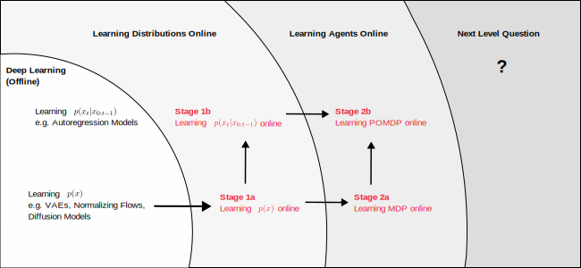

This page is updated time to time

# Central research question

> **What is the universal algorithm, once deployed into interation with the world, will learn by itself and finally induce General Intelligence?**

Apparently human brain contains such an algorithm. Let's call it **General Learner** to distinguish from General Intelligence. It seems some deep learning system is close to achieving General Intelligence, yet none of them are General Learners.

A deep learning model has clear phases in its life cycle, pretraining, finetuning, inference etc. Model weights are frozen and learning are stopped once the model is deployed for inference. General Learners have no such limits, they perform inference and learning simultaneously, new experiences are continuously learned into the model while they interact with the world and fulfill tasks.

The current mainstream trend is to pretrain foundational models, and make sure it adapts to diverse enough situations via "in-context learning". With a big enough pretraining dataset, and an infinite context window, we may side-step online learning. The philosophy behind this is to solve the online problem under the offline paradigm, which falls well within the comfort zone of deep learning. And since we know deep learning works very well, bringing a problem into its comfort zone often works.

While it is true that "in-context learning" is a powerful tool that provides a substitute when online learning is not available. But are we satisfied? At least for the moment, we're not. If "in-context learning" is enough, we wouldn't need to iterate the models from GPT-3 to GPT-4 and GPT-5, we would just put the new data (both pretraining & instruction tuning) in the context. In contrast, the reality is that we still rely on expensive and time consuming offline training procedures for storing information in the long term memory (model weights).

My research goal listed in this page starts with getting out of the comfort zone of deep learning and to learn online. I suppose it is the first step towards the ultimate General Learner. There are many other names that relates to online learning, i.e. continual learning, lifelong learning, never-ending learning etc. People may have their own perspective on the meaning of these terms and prefer different terms. I find online learning the most clearly defined, and closest to the learning paradigm I am after.

# Roadmap
I break them down into several stages, the stages are dependent on each other, however, sometimes research on a later stage can still be carried out by assuming that the its dependencies are solved.

# Stage 1: Learning distributions online
- **Stage 1a**: Given a sequence of observations $\\{x_t\\}$, learn the time averaged probability distribution $p(x)$ **online**. \
  Optimal continual learning (or Follow the Leader online learning) [requires perfect information](https://arxiv.org/abs/2006.05188). Although in the online learning literature, regret bounds are proved without such assumptions. I suppose the assumptions in online learning are often too strong (convex w.r.t. the parameters), making the baseline that the regret is computed against too weak. Therefore I believe online learning would only make sense in the context of near perfect information. The model needs to implicitly captures the information of all data, aka, it needs to be probabily models. Follow the Leader online learning on maximum likelihood objective function is also called [ML-plugin code](https://direct.mit.edu/books/book/3813/The-Minimum-Description-Length-Principle), which is one of the prequential codes. The research goal at stage 1a is basically designing a ML-plugin code that works for high dimensional time series. (TODO: Discuss why [LLM is compression](https://openreview.net/forum?id=jznbgiynus) but is not a prequential code.) (TODO: describe potential paths towards implementing an efficient algorithm for stage 1a, and why current deep learning would fail this task.)

- **Stage 1b**: Given the same sequential observation, learn the autoregressive distribution $p(x_t|x_{0:t-1})$ **online**. \
  This is the most general form of prequential code.
   
# Stage 2: Learning agents online
This stage is quite close to developing a practical implementation to AIXI. Firstly, if we solve stage 1, it gives us a prequential code which is a practical and reasonable replacement for the solomonoff induction in AIXI. Stage 2 it is about a practical implementation of the return maximization part.

Estimate the return directly is very inefficient, therefore value functions are introduced in RL literature, i.e. Q learning, actor-critic. At stage 2 we need to study whether these RL techniques can be converted into online versions. We know that Q learning is online in the tabular case, therefore we could use the tool developed in stage 1 to create online Q learning on non-tabular cases. We also know that in actor-critic value functions and policies depends on each other, therefore it may be difficult to develop an online version.

- **Stage 2a**: With the online learnable $p(x)$ provided by stage 1a, find a solution to MDP.
- **Stage 2b**: With the online learnable $p(x_{t}|x_{0:t-1})$, and the tools developed in Stage 2a, solve POMDP.

# Stage 3: Next level questions

These are far away in the future, but just writing down my thinkings.

## What is the univeral reward function?

Predicting what would happen next is not enough. Agents need a signal on what to do and what not to do, combining these two gives us AIXI. However, currently rewards are usually designed for specific tasks. Humans take a wider source of reward signals, for example, food, sleep, and most importantly language feedbacks from other human beings. Most of the rewards for human adults are indirect, e.g. digits in the bank account, a working experiment run, these rewards are also observations. just like other inputs to our brains, they have no special meaning when we're infants. There is a mechanism that these plain observations get associated with rewards. It could start with our innate reward signal, the dopamine, which is triggered when we have direct rewards like food. Food is associated with mother, and therefore the image & sound signal of mother becomes a reward. In a similar mechanism we may associate the language singal "Yes" and "No" with positive and negative rewards.

The training of LLMs offers some inspiration. Except the online part, pretraining of LLMs plays the role of sequence prediction in stage 1b. For stage 2b, the choice of LLMs is instruction tuning, which uses reward signal from human. Therefore, I hypothesize that we could do the same with an online deployed agent.

1. We can create a "Yes" button and a "No" button to be wired to the agent's innate reward mechanism, by pressing the button, we provide reward signals to shape its behavior. We press them as the agent interacts with the world. This is like the RLHF of today's LLMs done online.
2. The "Yes" and "No" signal from 2 is also part of the agent's observations, therefore the probability model learned would have captured the correlation between the reward signal and other observations (like language). Till then, we hope we could just use language to give feedbacks for teaching the agent.

(TODO: curiousity needs to be included to the reward. Mutual information could be a tool to unite probability learning part and the exploration part.)

## What does a General Learner do when there's no inputs.

Human brains are hidden variable models, even when we don't see, listen to anything, our latent variables are still constantly evolving, e.g. meditation & dreams. We learn from these internal activities, we develop new ideas via meditation. How do we include latent variables in $p(x_t|x_{0:t-1})$ so that the learning algorithm learn from meditation when there is no $x$? What should be the learning objective and learning rule for latent variables alone?

